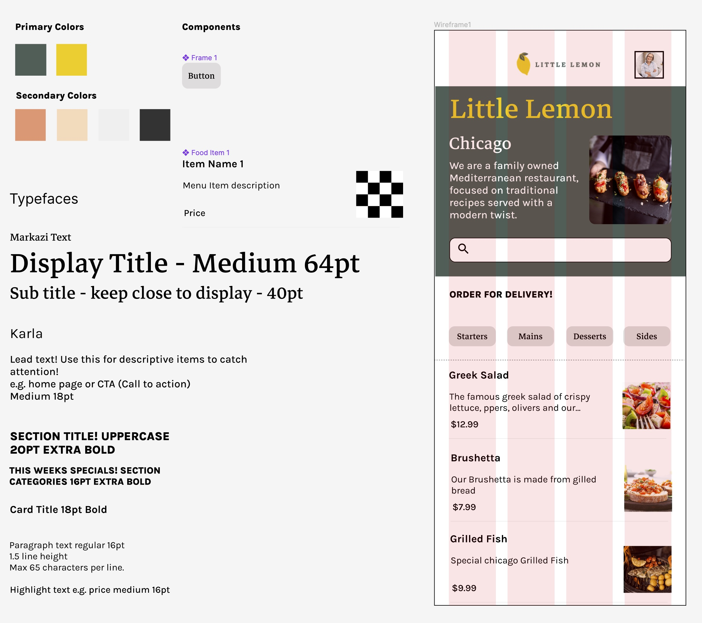
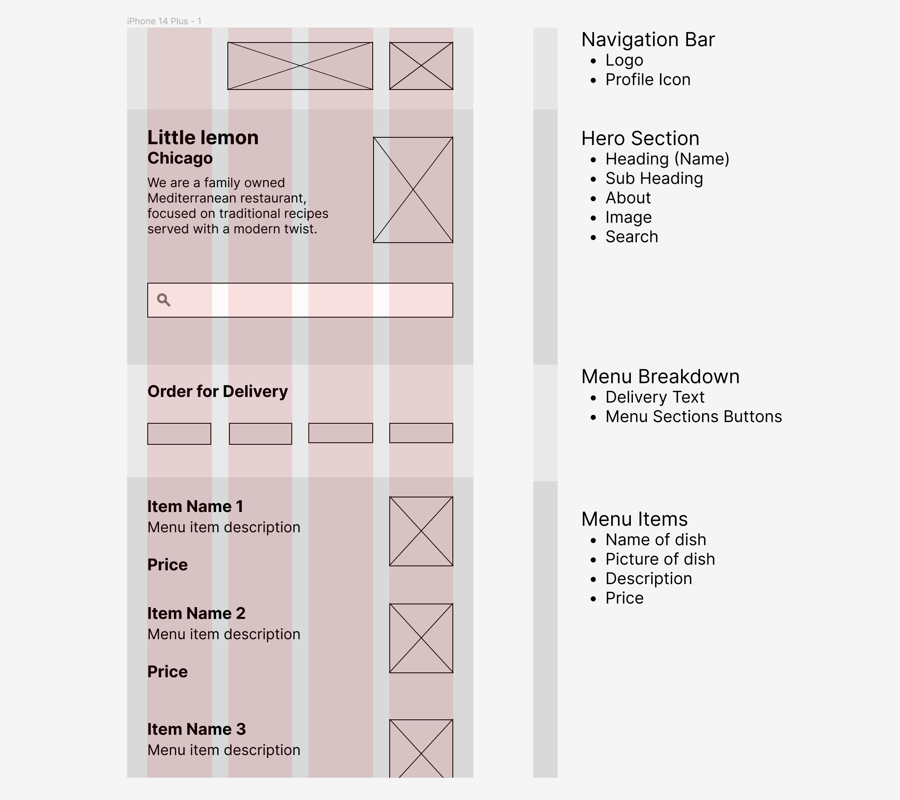

# Little Lemon - Restaurant App (iOS)
Capstone project for Meta iOS Developer Professional Certificate

**Screen FLow:**
Registration Screen -> Home Screen -> Profile Screen

- The app allows the user to register and display the menu as a scrollable list with title, description and price for each food item.
- The user can easily search the menu by selecting the categories and using the search bar to narrow it down.
- Profile details of the user can be updated anytime in the Profile screen accessed via the users Profile icon.
- The user can logout anytime by navigating to the Profile screen and pressing the Logout button.

The focus on SwiftUI & UI/UX Design, this project does NOT include advanced architectural concepts, layering, protocols etc to keep it simple.

## Design for Home screen

## Wireframe for Home screen

